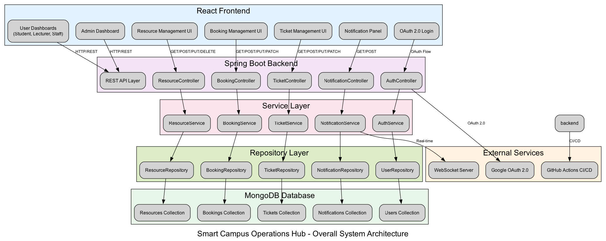
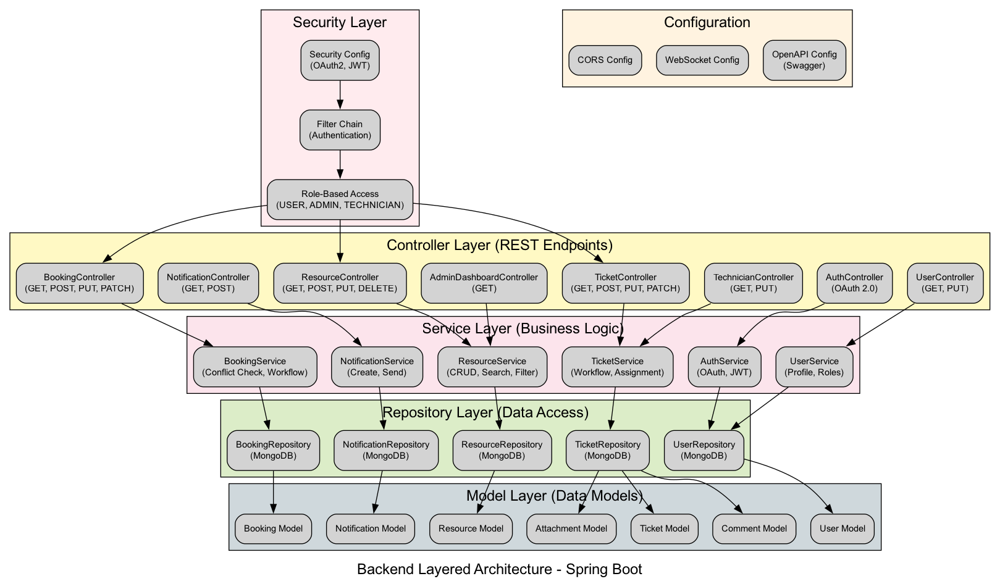

# Smart Campus Operations Hub

IT3030 PAF Assignment 2026 | Group Y3S1-WD-93

## Overview
University facility management system with resource booking, incident ticketing, and real-time notifications.



## Features

- **Facilities Catalogue** - Manage bookable resources (halls, labs, equipment) with search/filter
- **Booking Management** - Request bookings with approval workflow and conflict detection
- **Incident Ticketing** - Create tickets with attachments, assign technicians, track resolution
- **Notifications** - Real-time updates via WebSocket for bookings, tickets, and comments
- **Authentication** - OAuth 2.0 Google sign-in with role-based access control

## Tech Stack

- **Backend**: Spring Boot 3.x, MongoDB, Spring Security OAuth2
- **Frontend**: React 18, DaisyUI, Tailwind CSS
- **Build Tools**: Maven, Vite
- **Database**: MongoDB Atlas
- **Version Control**: Git, GitHub Actions

## Project Structure

```
project-root/
├── backend/                 # Spring Boot application
│   ├── src/main/java/       # Java source code
│   │   ├── controller/      # REST controllers
│   │   ├── service/         # Business logic
│   │   ├── repository/      # Data access layer
│   │   ├── model/           # Data models
│   │   ├── security/        # OAuth2 & JWT configuration
│   │   └── config/          # Application configuration
│   └── pom.xml              # Maven dependencies
├── frontend/               # React application
│   ├── src/
│   │   ├── components/      # Reusable components
│   │   ├── pages/           # Page components
│   │   ├── services/        # API service calls
│   │   ├── context/         # React context (auth)
│   │   └── hooks/           # Custom hooks
│   └── package.json         # Node dependencies
├── docs/                   # Documentation
│   ├── architecture-diagrams/  # Architecture diagrams
│   └── testing/               # Postman collections & screenshots
├── .github/                # GitHub Actions workflows
└── README.md
```

## Setup Instructions

### Prerequisites
- Java 17
- Node.js 18+
- MongoDB (local or Atlas)
- Google OAuth credentials

### Backend Setup



1. Navigate to backend: `cd backend`
2. Run: `./mvnw spring-boot:run`

**Important: Java Version Compatibility**
- The project requires **Java 17** to run properly
- If your system has Java 25 as default, you may encounter Lombok compilation errors:
  ```
  WARNING: A terminally deprecated method in sun.misc.Unsafe has been called
  [ERROR] Fatal error compiling: java.lang.ExceptionInInitializerError
  ```

**For macOS (Homebrew):**
- Set JAVA_HOME to Java 17 before running:
  ```bash
  export JAVA_HOME=/opt/homebrew/Cellar/openjdk@17/17.0.18/libexec/openjdk.jdk/Contents/Home
  ./mvnw spring-boot:run
  ```
- **Permanent fix**: Add to your shell profile (~/.zshrc or ~/.bash_profile):
  ```bash
  export JAVA_HOME=/opt/homebrew/Cellar/openjdk@17/17.0.18/libexec/openjdk.jdk/Contents/Home
  export PATH=$JAVA_HOME/bin:$PATH
  ```

**For Windows:**
- Install Java 17 from [Adoptium](https://adoptium.net/) or [Oracle](https://www.oracle.com/java/technologies/downloads/#java17)
- Set JAVA_HOME environment variable to your Java 17 installation path (e.g., `C:\Program Files\Eclipse Adoptium\jdk-17.0.18.101-hotspot`)
- Add Java 17 bin directory to PATH
- Verify: `java -version` should show Java 17
- If multiple Java versions are installed, set JAVA_HOME before running:
  ```cmd
  set JAVA_HOME=C:\Program Files\Eclipse Adoptium\jdk-17.0.18.101-hotspot
  .\mvnw.cmd spring-boot:run
  ```

### Frontend Setup
1. Navigate to frontend: `cd frontend`
2. Install dependencies: `npm install`
3. Run: `npm run dev`

## API Documentation
Swagger/OpenAPI documentation is available at: `http://localhost:8080/swagger-ui.html` when the backend is running.

## Contributing Guidelines
- Create feature branches from `develop`
- Write meaningful commit messages
- Update tests for new features
- Ensure CI passes before merging

## License
This project is created for educational purposes at SLIIT.